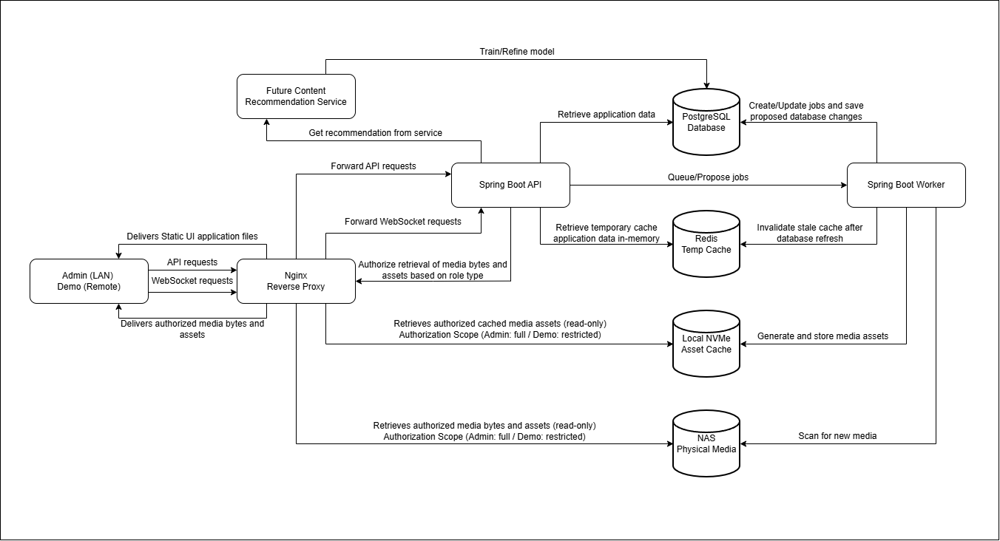

# OtakuNest Software Architecture Document

**Primary audience:** Shaheen Mohammed  
**Document purpose:** To define the high-level software architecture of OtakuNest

## 1. Executive Summary

OtakuNest is a private, ultra-fast, anime and manga viewing desktop application.  The application has two account types.  The administrator account has full access to OtakuNest via LAN connection.  The demo account has limited access to OtakuNest and is provided with a heavily restricted manga and anime library; the demo account is solely used to display the application's capabilities and can be connected via a remote connection.  OtakuNest aims to provide seamless 4K video and manga reading capabilities from a library containing over 1.5 million images and 5000 videos.  The application will have two future features that will make it unique; an anime <-> manga linkage system and an AI content recommendation service.  The anime <-> manga linkage system will allow users to seamlessly switch between anime and its manga correspondent and vice versa.  This provides the user with the convenience of reading ahead when the anime stops at a cliffhanger or wanting to watch the anime version of your favourite scenes in a manga.  The content recommendation service will trained and refined using the Constraint Object Heirarchies (COH) model and will aim to balance personalization with serendipity while suggesting an unwatched anime or manga to the user.

OtakuNest will run using the Docker Desktop App.  Nginx will be used as a reverse proxy and an application-layer router.  Spring Boot is used to authenticate and authorize API and WebSocket requests, apply business logic, and use JWT authentication for validating users.  OtakuNest will also have a PostgreSQL database to hold all current application data, Redis for temporary in-memory cache, and Flyway for schema migrations.  All original media files and assets will be stored on a NAS, and a 4TB NVMe local cache will be used to store frequently used media assets.

## 2. Architectural Goals

| Goal | Solution |
|---|---|
| Seamless Media Discovery | Indexed PostgreSQL search, paginated search results (max 20 cards per page), Redis caching |
| Seamless Playback and Reading | Nginx authorized read-only access to NAS/NVMe local cache and dynamic media loading based on user progress |
| Safe Library Maintenance | Worker proposes jobs and proceeds with those jobs after administrator approval |
| Clear Security Boundaries | Nginx is the only exposed OtakuNest service; LAN access is only given to the administrator and demo users have remote access to a heavily restricted version of OtakuNest |
| Future Content Recommendation Service | A separate internal service; can be introduced without changing overall design of OtakuNest |
| OtakuNest Operations | Pinned container versions for Docker, backup/restore plan, logging and health checks of software, predictable NAS and NVMe mounts/volumes |

## 3. Scope and Future Capabilities

This section defines the scope of work for the initial release of OtakuNest and any work that is intentionally deferred to future releases.

### 3.1 Initial Release 
| Area | Work |
|---|---|
| Deployment | Configure Nginx, Spring Boot API, Spring Boot worker, PostgreSql database, and Redis containers using Docker |
| Users | Create an administrator account and a demo account |
| Frontend | Build React + Vite UI; no plans for tablet and mobile UIs |
| Media Library | Store all media files and assets stores in stored in NAS |
| Media Delivery | Spring Boot API authorizes forwared requests from Nginx; Nginx delivers authorized media files and assets from NAS/local NVMe cache |
| Video Player | Video.js player with modern video playback features |
| Manga Reader | Create reader with resume reading feature, default reading orientation for specific type of manga, keyboard navigation, zoom, automatic next-chapter transition, and lazy loading |
| Progress Tracking | track and store user episode and chapter progress in database |
| Search navigation | 20-card cursor pages.  The user must select the 'Apply Filter' Button to search with filters such as tags, genres, studios, titles, artists.  Search starts when three typed characters are inputted.  Use React to manage visited cursor pages |
| Metadata Management | Administrator can only edit and add any metadata to exsisting and new media files and assets |
| Worker Processing | Weekly scans.  Worker scans Nas and proposes changes.  The administrator approves these changes and the worker, generates assets, updates the database and then invalidates the in-memory cache |
| Real-time Updates | WebSocket provides real-time updates on job status to administrator |
| Caching | Redis holds temporary application data and local NVMe holds frequently used media assets |
| Database Management | PostgreSQL database runs on local NVMe and Flyway manages schema migrations |
| Operations | Health checks and logging for OtakuNest, pinned container versions, and a proven backup/restore strategy |

### 3.2 Future Features and Services
| Feature or Service | Work |
|---|---|
| Recommendation service | Train service using COH model with application data within database.  The service will recommend an unwatched anime or manga based on trained model | 
| Anime <-> manga linkage system | Map each chapter to each episode using timestamps of where the chapter starts and ends within the episode |
| Casting and TV Playback | Seamlessly watch on a TV.  Possibly use a rasberry PI | 
| Public Internet Exposure | Watch my anime and manga at anywhere there's internet |
| User accounts | Create a new role type that has full access to OtakuNest without administrator privileges |
| UI improvements | Create UI for tablet and mobile devices; UI personalization features |
| Comment Section | Write comments on any anime or manga | 

## 4. Data-Flows

| Container or subsystem | Primary responsibility | Persistent state |
|---|---|---|
| React Frontend | UI, active-session page cursor map, Video.js controls, manga reader rendering, UI | UI/session state |
| Nginx | Delivers authorized media files and assets to client, forwards client requests to Spring Boot API | Versioned configuration and static UI build |
| Spring Boot API | Authentication and authorization of HTTPS REST/WSS requests, holds all business logic, and creates scan requests and records administrator approval decisions | Stateless service; application data stored in PostgreSQL |
| Spring Boot worker | Scans NAS for new media, performs administrator-approved jobs on NAS/NVMe, updates database, and invalidates Redis cache | Job status in PostgreSQL |
| PostgreSQL primary | Stores application data | Local NVMe; authoritative |
| Redis | Stores temporary application data in-memory| Rebuildable; non-authoritative |
| NVMe asset cache | Thumbnails, posters, seekbar images | Local NVMe; rebuildable from originals within NAS |
| NAS | Original media, subtitles, source pages/art, NAS backup location | NAS disks |
| Future Content Recommendation Service | Recommend manga or anime based on trained model | Design and implementation is yet to be defined |

### 4.1 Primary Request Paths

| Path | Flow | Rationale |
|---|---|---|
| User interface | Browser -> Nginx -> Browser | Nginx serves static UI application files |
| REST API | Browser -> Nginx -> Spring Boot API -> PostgreSQL/Redis -> Spring Boot API -> Nginx -> Browser | Spring Boot API authorizes and authenticates client requests to access media files, assets, and application data.  Nginx fowards client requests and relays Spring Boot API responses.  Nginx also delivers authorized media bytes and assets |
| Video/page delivery | Browser -> Nginx -> read-only NAS/NVMe asset cache -> Browser | Use Nginx for efficient media byte and asset delivery (bypass JVM) |
| Approved worker operation | Worker -> PostgreSQL database job state -> controlled write to NAS/NVMe asset cache -> update PostgreSQL database -> invlalidate stale Redis cache | Execution of proposed changes must be administrator approved; execution of scans can happen without approval |
| Future recommendation | Browser -> Spring Boot API -> content recommendation service -> Spring Boot API -> Browser | This is still a work in progress, the pathing might change |

## 5. Security Policies

The client only communicates to Nginx which prevents the client from directly connecting to any critical software components.  The demo account uses the normal authentication path and has a restricted media library to test the capabilities of OtakuNest.  The demo account cannot use any administrator capabilities and cannot view any real-time information from worker via WebSocket.

### 5.1 Authentication and Authorization Policies

| Topic | Initial policy |
|---|---|
| Accounts | One administrator account and one restricted demo account |
| Sign-in success | Spring Boot uses JWT authentication to validate user credentials and account status against PostgreSQL |
| Sign-in failure | Generic response; no account-existence disclosure; no catalog/media access granted |
| Cooldown | Five failed attempts within 15 minutes trigger a 24-hour cooldown for both administrator and demo accounts |
| Override | Authenticated administrator may override cooldown; action enters audit history |
| Demo isolation | Demo requests receive only separate demo media/catalog results, including images, search, manifests, and future recommendations |
| Administrative changes | Only administrator has full authoritative access to OtakuNest |

## 6. Storage and Cache

Original media and application data are kept separate from temporary cache.  NAS contains all original media files and assets.  PostgreSQL holds all authoritative application data.  Redis in-memory cache and frequently used media assets on local NVMe cache are non-authoritative and rebuildable.

| Data class | Storage | Cache | Recovery Solution |
|---|---|---|---|
| Original media files and assets | NAS | Browser cache, NAS read SSD cache | NAS backup/snapshot and separate recovery copy strategy |
| Authoritative application data | PostgreSQL local NVMe | Redis | Restore PostgreSQL backup, rerun cache warming |
| React UI | Local NVMe/Nginx | Browser immutable cache | Rebuild from source repository |
| Non-authoritative media assets | Local NVMe cache | Browser cache | Regenerate from NAS |

## 7. Future Content Recommendation Service 

Design and implmentation needs to be further planning

